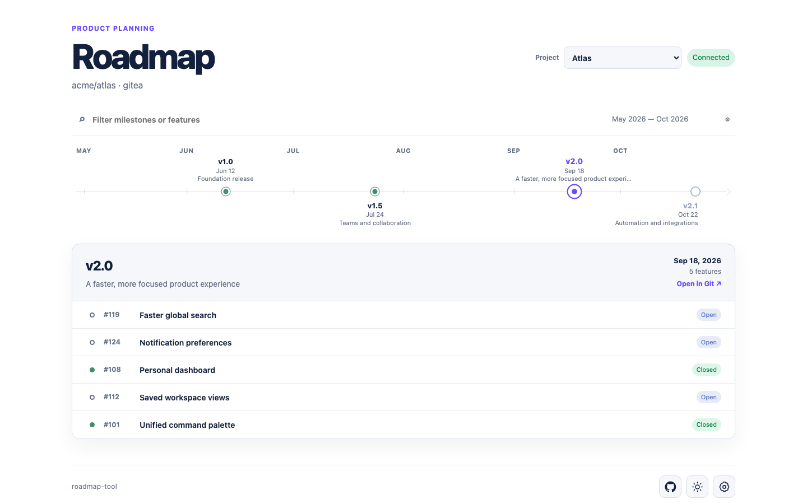

# roadmap-tool

Локальная read-only веб-утилита для roadmap из milestones и issues GitHub, GitLab или Gitea.



В **Settings** создайте подключение и один или несколько проектов. На timeline попадают milestones с due date, а внутри выбранного milestone показываются только issues, которые одновременно:

- привязаны к этому milestone;
- содержат настроенный feature label.

Проекты переключаются в шапке. Цвета и геометрия timeline настраиваются отдельно для каждого проекта. Конфигурация хранится в `config.json`, токены — отдельно в `secrets.json` и не попадают в экспорт.

## Запуск

Нужен Go 1.23+.

macOS / Linux:

```bash
cp config.example.json config.json
go run ./cmd/roadmap
```

Windows PowerShell:

```powershell
Copy-Item config.example.json config.json
go run .\cmd\roadmap
```

Откройте <http://127.0.0.1:8080>. Для остановки нажмите `Ctrl+C`.

### Docker

```bash
docker compose up -d --build
```

Контейнер работает на <http://127.0.0.1:8080>, автоматически перезапускается после сбоя или перезагрузки Docker. Конфигурация и токены сохраняются в volume `roadmap-data`.

```bash
docker compose logs -f roadmap   # логи
docker compose stop              # остановить
docker compose start             # запустить снова
docker compose down              # удалить контейнер, сохранив volume
```

## Токены GitHub, GitLab и Gitea

Для публичного репозитория токен иногда не требуется. Для приватного создайте read-only токен с минимальными правами:

- **GitHub:** Settings → Developer settings → Personal access tokens → Fine-grained tokens. Ограничьте доступ нужным repository и выдайте `Issues: Read-only`. [Официальная инструкция](https://docs.github.com/en/authentication/keeping-your-account-and-data-secure/managing-your-personal-access-tokens).
- **GitLab:** avatar → Edit profile → Access → Personal access tokens. Создайте token со scope `read_api`. [Официальная инструкция](https://docs.gitlab.com/user/profile/personal_access_tokens/).
- **Gitea:** User Settings → Applications → Manage Access Tokens. Достаточно `read:issue` и `read:repository`. Токен показывается только один раз. [Официальная инструкция](https://docs.gitea.com/1.26/development/api-usage/).

Затем откройте **Settings** в roadmap-tool, выберите connection, вставьте токен в **Access token** и нажмите **Save token**. Для GitHub и GitLab Base URL можно оставить пустым; для Gitea укажите адрес сервера, например `https://git.example.com`.

Если Gitea запущена на том же компьютере, для локального запуска используйте `http://localhost:3000`, а внутри Docker — `http://host.docker.internal:3000`.
